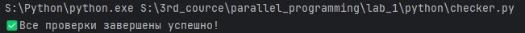
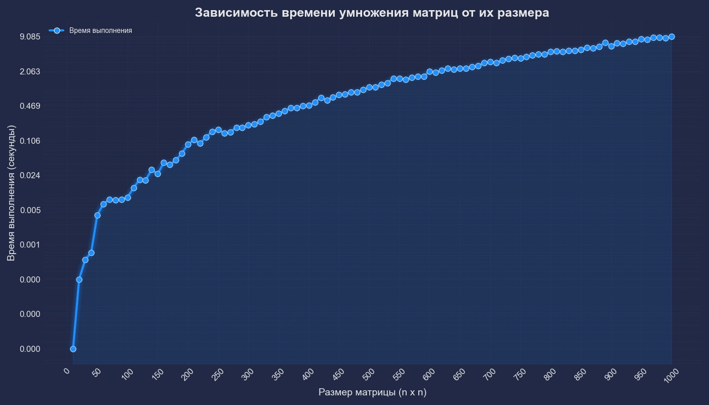

# Лабораторная работа №1  
## Тема: Умножение матриц и автоматизированная верификация результатов

---

###  Цель работы

Разработка программы на языке C/C++ для перемножения двух матриц с последующей автоматизированной верификацией результатов при помощи Python. Также — исследование зависимости времени выполнения от размера задачи.

---

###  Ход выполнения работы

1. Реализована программа на языке C++ для умножения двух квадратных матриц.
2. Разработан скрипт на Python с использованием библиотеки NumPy для автоматической проверки корректности результата.
3. Разработан скрипт на Python для построения графика зависимости времени выполнения от размера матрицы.
4. Все проверки завершились успешно, результат умножения совпадает с результатом, полученным в Python, график зависимости был построен.

---

###  Структура проекта

```
LAB_1/
│
├── c++/
│   ├── main.cpp
│   ├── matrix.cpp
│   ├── matrix.h
│   └── CMakeLists.txt
│
├── matrix/
│   └── NxN/
│       ├── first_matrix.txt
│       ├── second_matrix.txt
│       └── result.txt
│
├── python/
│   ├── checker.py
│   ├── graph.py
│   └── config.json
```

---

### Результаты экспериментов

#### Результат проверки:



#### График зависимости времени выполнения от размера матрицы:



###  Выводы

- Реализация алгоритма умножения матриц в C++ показала ожидаемую временную сложность O(n³) — время выполнения стремительно увеличивается с ростом размера матрицы.
- Автоматизированная проверка результатов с помощью Python (NumPy) показала корректность реализации: все матричные произведения совпадают.
- Построенный график демонстрирует нелинейный рост времени, особенно заметный при больших размерах (от 500x500 и выше).
