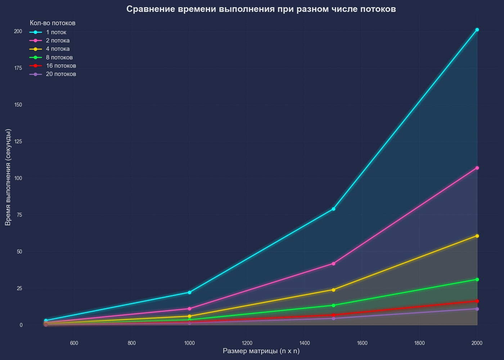

# Лабораторная работа №1  
## Тема: Умножение матриц и автоматизированная верификация результатов

---

###  Цель работы

Разработка программы на языке C/C++ для перемножения двух матриц с последующей автоматизированной верификацией результатов при помощи Python. Также — исследование зависимости времени выполнения от размера задачи.

---

###  Ход выполнения работы

1. Реализована программа на языке C++ для умножения двух квадратных матриц.
2. Разработан скрипт на Python с использованием библиотеки NumPy для автоматической проверки корректности результата.
3. Разработан скрипт на Python для построения графика зависимости времени выполнения от размера матрицы.
4. Все проверки завершились успешно, результат умножения совпадает с результатом, полученным в Python, график зависимости был построен.

---

###  Структура проекта

```
LAB_1/
│
├── c++/
│   ├── main.cpp
│   ├── matrix.cpp
│   ├── matrix.h
│   └── CMakeLists.txt
│
├── matrix/
│   └── NxN/
│       ├── first_matrix.txt
│       ├── second_matrix.txt
│       └── result.txt
│
├── python/
│   ├── checker.py
│   ├── graph.py
│   └── config.json
```

---

### Результаты экспериментов

#### Результат проверки:


#### График зависимости времени выполнения от размера матрицы:


###  Выводы

- Реализация алгоритма умножения матриц в C++ показала ожидаемую временную сложность O(n³) — время выполнения стремительно увеличивается с ростом размера матрицы.
- Автоматизированная проверка результатов с помощью Python (NumPy) показала корректность реализации: все матричные произведения совпадают.
- Построенный график демонстрирует нелинейный рост времени, особенно заметный при больших размерах (от 500x500 и выше).


# Лабораторная работа №2  
## Тема: Параллельное умножение матриц с использованием OpenMP

---

### Цель работы

Модификация последовательного алгоритма умножения матриц с использованием технологии OpenMP для организации параллельной обработки. Исследование влияния количества потоков на производительность.

---

### Ход выполнения работы

1. Исходная программа из ЛР №1 была адаптирована для многопоточной обработки с использованием директив OpenMP.


2. Добавлены замеры времени выполнения при различных количествах потоков (1, 2, 4, 8, 16).
3. Организован вывод результатов по каждому количеству потоков в отдельные каталоги.

4. Внесены изменения в Python-скрипты:
   - `checker.py` теперь проверяет корректность умножения во всех потоках.
   - `graph.py` строит один сводный график зависимости времени выполнения от размера задачи для каждого количества потоков.
5. Все результаты успешно проверены, валидация пройдена.

---

### Структура проекта

```
LAB_2/
│
├── c++/
│   ├── CMakeLists.txt
│   ├── main.cpp
│   ├── matrix.cpp
│   └── matrix.h
│
├── matrix/
│   ├── threads_1/
│   │   └── NxN/
│   │       ├── first_matrix.txt
│   │       ├── second_matrix.txt
│   │       └── result.txt
│   ├── threads_2/
│   ├── threads_4/
│   ├── threads_8/
│   └── threads_16/
│
├── python/
│   ├── checker.py
│   ├── graph.py
│   └── config.json
```

---

### Результаты экспериментов

#### Проверка корректности умножения при различном количестве потоков:


#### График зависимости времени выполнения от размера задачи (по потокам):


---

### Выводы

- Использование OpenMP позволило существенно ускорить выполнение программы при увеличении числа потоков.
- Наибольший прирост производительности наблюдается при переходе от 1 к 2 и 4 потокам.
- При количестве потоков больше 8 наблюдается эффект насыщения, особенно на небольших задачах.
- График наглядно демонстрирует эффективность многопоточности при больших объёмах данных.

---

# Лабораторная работа №3
**Тема:** Параллельное умножение матриц с использованием MPI

## Цель работы
Модификация последовательной программы умножения матриц с использованием технологии **MPI** для распараллеливания по процессам и исследования производительности на суперкомпьютере **«Сергей Королёв»**.

---

## Ход выполнения работы

### 1. Модификация исходной программы
- В основу легла программа из лабораторной работы №1.
- Реализована параллельная версия с использованием **MPI** — строки матрицы распределяются между процессами.
- Выполнены тесты для **1, 2, 4, 8, 16** процессов.


### 2. Запуск на суперкомпьютере «Сергей Королёв»
- Программа была собрана на СК.
- Использовались:
   - **WinSCP** — для передачи исполняемых файлов и PBS-скриптов.
   - **PuTTY** — для SSH-доступа и удалённого запуска расчётов.
- Написан PBS-скрипт `run.pbs` для запуска через SLURM:
```bash
#!/bin/bash
#SBATCH --job-name=main
#SBATCH --time=0:05:00
#SBATCH --ntasks-per-node=1
#SBATCH --partition=batch

module load intel/mpi4
mpirun -r ssh ./matrix_mpi
```

### 3. Сбор и хранение результатов
- Время выполнения фиксировалось в `.txt`-файлы по каждому количеству процессов.
- Формат:
```
Matrix Size: 2000x2000  
Multiplication Time: 1.93473 seconds  
Threads: 16  
```

### 4. Построение графиков
- Python-скрипт `SK_graph.py`:
   - Автоматически парсит результаты
   - Строит графики зависимости **времени выполнения от размера матриц**
   - Поддерживает любое количество процессов
  

---

## Структура проекта
```
LAB_3/
│
├── c++/
│   ├── CMakeLists.txt
│   ├── main.cpp
│   ├── matrix.cpp
│   ├── matrix.h
│   └── run.sh
│
├── matrix/
│   ├── threads_1/
│   ├── threads_2/
│   ├── threads_4/
│   ├── threads_8/
│   └── threads_16/
│
├── matrix_SK/
│   ├── 1 potok.txt
│   ├── 2 potok.txt
│   ├── 4 potok.txt
│   ├── 8 potok.txt
│   ├── 16 potok.txt
│   └── 20 potok.txt
│
├── python/
│   ├── checker.py
│   ├── graph.py
│   ├── SK_graph.py
│   └── config.json
│
├── super pc SK/
│   ├── matrix_mpi
│   ├── super_pc.cpp
│   └── run.pbs
```

---

## Выводы
- **MPI** позволяет эффективно распределить вычисления между процессами.
- С ростом количества процессов наблюдается **снижение времени** выполнения.
- На больших матрицах (до 2000×2000) **ускорение становится особенно заметным**.
- При дальнейшем увеличении числа процессов появляется **эффект насыщения**.
- Визуализация с помощью Python-скрипта облегчает анализ производительности.


---
# Лабораторная работа №4  
## Тема: Параллельное умножение матриц с использованием CUDA

---

**Лабораторную работу выполнили студенты группы 6313-10.05.03D:**
- Насонов Михаил
- Мантров Илья
- Шаменков Максим

---

### Цель работы

Модификация существующей программы на языке C++ для выполнения параллельного умножения матриц с использованием технологии CUDA. Дополнительно — автоматизированная верификация результатов с помощью Python с ускорением через GPU.

---

### Ход выполнения работы

1. **Модифицирована** программа на языке C++, разработанная в лабораторной работе №1:
   - Реализовано распараллеливание вычислений с помощью CUDA.
   - Для каждой комбинации "размер матрицы — количество потоков" запускается своё ядро CUDA.
2. **Адаптированы скрипты Python** из лабораторной работы №2:
   - `checker.py` теперь поддерживает ускорение на GPU через библиотеку `cupy`, что позволяет существенно ускорить проверку больших матриц.
   
   
3. **Построен график**, демонстрирующий влияние количества потоков на скорость выполнения.
4. Все проверки матриц завершились успешно .

---

###  Структура проекта

---

```
LAB_4/
│
├── c++/
│   ├── CMakeLists.txt
│   ├── main.cpp
│   ├── matrix.cpp
│   └── matrix.h
│
├── cuda/
│   ├── cuda_multiply.cu
│   └── cuda_multiply.h
│
├── matrix/
│   ├── threads_1/
│   │   └── NxN/
│   │       ├── first_matrix.txt
│   │       ├── second_matrix.txt
│   │       └── result.txt
│   ├── threads_2/
│   ├── threads_4/
│   ├── threads_8/
│   └── threads_16/
│
├── python/
│   ├── checker.py
│   ├── graph.py
│   └── config.json
```
---

### Результаты экспериментов

#### Пример проверки корректности:


#### Построенный график зависимости:

ы

---

### Выводы

- Использование CUDA позволило существенно ускорить процесс умножения больших матриц по сравнению с обычным CPU-подсчётом.
- Увеличение количества потоков в CUDA (`1 → 2 → 4 → 8 → 16`) заметно снижает время выполнения операций.
- Применение `cupy` для проверки матриц позволило ускорить верификацию результатов даже на матрицах размером 5000×5000, что критически важно для крупных экспериментов.
- Построенные графики наглядно демонстрируют квадратичную зависимость времени от размера задачи, а также эффективность масштабирования потоков в CUDA.

---


